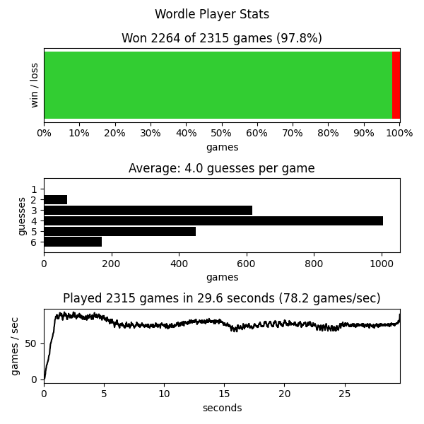

# Wordle Player

Code that plays [Wordle](https://www.powerlanguage.co.uk/wordle/)

(NOTE: The file words.json includes the solution of every wordle in order. Don't read it if you don't want spoilers.)

```sh
pip install -r requirements.txt

# play a specific game
./bin/help_me_play.py [--wordle_number 123]

# autoplay every game
python ./bin/wordle_player.py --help
```

Inspired by: [The Best Starting Word in Wordle](https://bert.org/2021/11/24/the-best-starting-word-in-wordle/)

## Results




