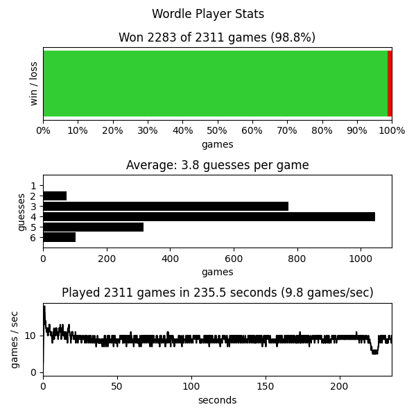

# Wordle Player

Code that plays [Wordle](https://www.powerlanguage.co.uk/wordle/)

(NOTE: The file words.json includes the solution of every wordle in order. Don't read it if you don't want spoilers.)

```sh
pip install "."

# play any wordle game you want
python ./bin/play_wordle.py --wordle_number=123

# get help playing wordle
./bin/help_me_play.py 

# autoplay every possible wordle game and generate stats on performance
./bin/auto_play.py 

```

Inspired by: [The Best Starting Word in Wordle](https://bert.org/2021/11/24/the-best-starting-word-in-wordle/)

## Results




